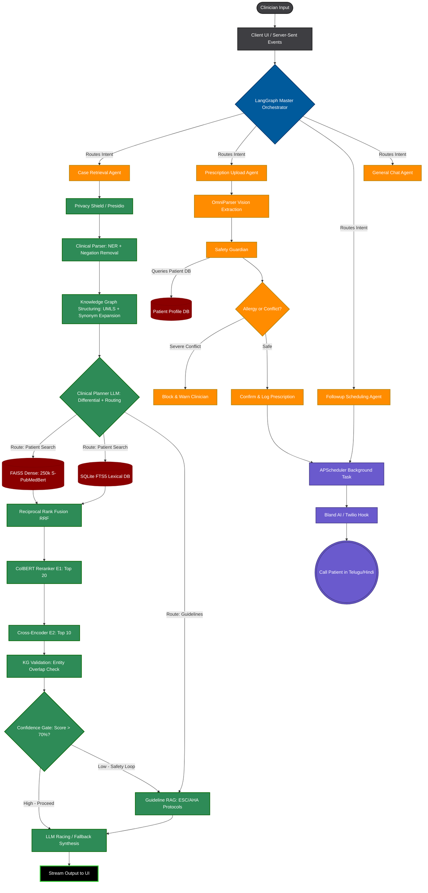

# Clinsight End-to-End Architecture

The following diagram illustrates the complete data flow of the Clinsight Multi-Agent Medical System, tracking how a user input enters the LangGraph Orchestrator and branches into either Clinical Case RAG, Prescription Safety Validation, or Telephony Follow-up.

> **Updated:** Added `Knowledge Graph Structuring` (UMLS/SNOMED ontology expansion) and `Clinical Planner LLM` (Differential Diagnosis + Routing) between Clinical Parser and Retrieval, as defined in the First Review document.

### Key Architectural Notes:
1. **LangGraph State Orchestration:** The `LangGraph Master Orchestrator` serves as the front door. It uses an LLM node to classify the exact clinical need before the heavy processing begins.
2. **Knowledge Graph Structuring (NEW):** After the Clinical Parser, the system maps all extracted entities to UMLS/SNOMED ontologies and expands synonyms (e.g., `STEMI → Myocardial Infarction → Heart Attack`). This expanded query is fed into FAISS, drastically improving recall precision.
3. **Clinical Planner LLM (NEW):** Before retrieval begins, a dedicated LLM generates a Differential Diagnosis and decides which route to take — Patient Database Search or Guideline RAG. This makes the system *adaptive* instead of always blindly searching.
4. **Confidence Gate with Safety Loop (NEW):** The Cross-Encoder's empirical scores are used to calculate a confidence percentage. If below 70%, the system automatically fetches Official Guideline RAG before synthesis, preventing hallucinations.
5. **Retrieval Pipeline Standardization:** Stage E2 (Cross-Encoder) strictly filters the Top 10 documents into the LLM context, mapping exactly to the Base Paper's `@10` metric.
6. **Automated Safety Loop (Prescription):** If a user successfully uploads a prescription, it parses, validates against the patient's existing allergies `Profile DB` via the `Safety Guardian`, and automatically flags the `APScheduler` to configure a Twilio checkup call.
